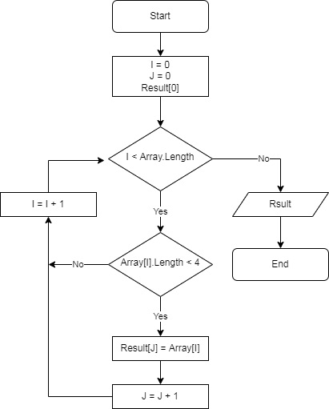

# **Инструкция по работе с программой**

## Описание
Программа выполняет преобразование входного массива строк в выходной массив строк, содержащий строки длиной менее четырех символов.
## Ввод данных
Обрабатываемый массив строк вводиться с клавиатуры, элементы разделяютсяя запятой
    
    hello, 2, world, :-   

## Результат обработки
Реультат работы программы выводиться на консоль в виде массива строк
    
    ["2", ":-"]

## Алгоритм
